Some IDA Python scripts for auto-analysis and a Hive-plot visualizer.

## IDA Python Scripts

The scripts in this repo are an extraction from a larger set of scripts used for semi-automated analysis in security assurance of Irdeto's anti-reverse-engineering technology. In that environment we developed other, more detailed, analyses on-top-of what you find in this repo. What we have published here are some simple, but also hopefully useful scripts. The scripts were developed over the period spanning 2016-2018; tempered by valuable feedback from Irdeto Ottawa Security Assurance teammates [@JonathanBeverley](https://github.com/JonathanBeverley) and [@kennethblite](https://github.com/kennethblite).

The IDA Python parts of the scripts use the [idascript framework](https://github.com/devttys0/idascript) from [@devttys0](https://github.com/devttys0) to enable both command-line and IDA Python shell command invocation. There are a couple features in this repo (as mentioned above, there are more advanced analysis features internally which we won't be releasing):

* batch+parallel analysis of a directory tree of binaries
* batch+parallel analysis of the binaries in an APK
* automating [rizzo](https://github.com/devttys0/ida/tree/master/plugins/rizzo) (also from [@devttys0](https://github.com/devttys0)) analysis
* using IDA for `strings` :)

## Hiveplot Binary Visualizer

Alongside those scripts above, we have also published an interactive hive-plot tool for visualizing the cross-references in a given IDA Pro `.idb`.

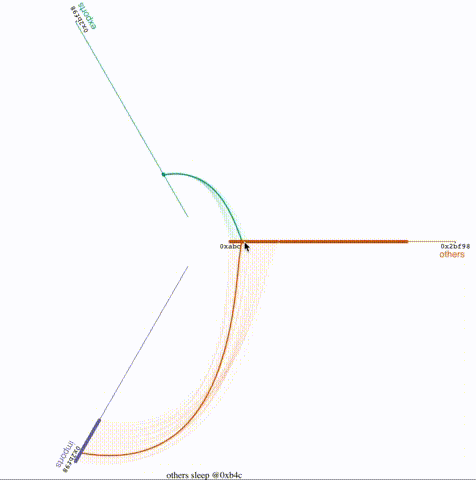

Hive plots are an idea first described by Krzywinski, Birol, Jones and Marra, please see http://www.hiveplot.com/. Mike Bostock (the author of [d3.js](https://d3js.org/)) made a [hive-plot plugin](https://github.com/d3/d3-plugins/blob/master/hive/hive.js) and a demo based on rendering of references in source code, please see https://bost.ocks.org/mike/hive/.

We have built on-top of the [d3-hive.js plugin](https://github.com/d3/d3-plugins/blob/master/hive/hive.js) and added some UI elements to make contextual analysis of binaries easier as well as adding dynamic adjustments to weights and other visual elements as one zooms through the plots.

### Samples

Here are some sample hive plots rendered from samples in https://github.com/maldroid/samples and https://github.com/JonathanSalwan/binary-samples. These were produced by running the `test/run_tests.sh` script:

[](img/MachO-OSX-ppc-and-i386-bash_allxrefs.json.png)
[](img/MachO-OSX-ppc-openssl-1.0_allxrefs.json.png)
[](img/MachO-OSX-x64-ls_allxrefs.json.png)
[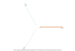](img/MachO-OSX-x86-ls_allxrefs.json.png)
[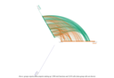](img/MachO-iOS-arm1176JZFS-bash_allxrefs.json.png)
[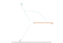](img/MachO-iOS-armv7-armv7s-arm64-Helloworld_allxrefs.json.png)
[](img/MachO-iOS-armv7s-Helloworld_allxrefs.json.png)
[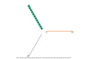](img/classes_allxrefs.json.png)
[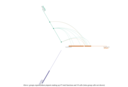](img/elf-FreeBSD-x86_64-echo_allxrefs.json.png)
[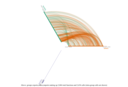](img/elf-HPUX-ia64-bash_allxrefs.json.png)
[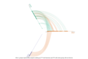](img/elf-Haiku-GCC2-ls_allxrefs.json.png)
[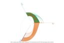](img/elf-Haiku-GCC7-WebPositive_allxrefs.json.png)
[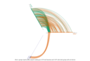](img/elf-Linux-ARM64-bash_allxrefs.json.png)
[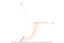](img/elf-Linux-ARMv7-ls_allxrefs.json.png)
[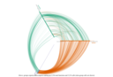](img/elf-Linux-Alpha-bash_allxrefs.json.png)
[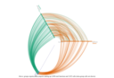](img/elf-Linux-Mips4-bash_allxrefs.json.png)
[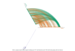](img/elf-Linux-PowerPC-bash_allxrefs.json.png)
[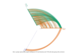](img/elf-Linux-SparcV8-bash_allxrefs.json.png)
[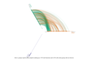](img/elf-Linux-SuperH4-bash_allxrefs.json.png)
[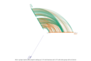](img/elf-Linux-hppa-bash_allxrefs.json.png)
[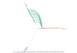](img/elf-Linux-ia64-bash_allxrefs.json.png)
[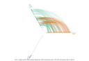](img/elf-Linux-lib-x64_allxrefs.json.png)
[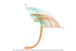](img/elf-Linux-lib-x86_allxrefs.json.png)
[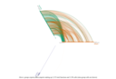](img/elf-Linux-x64-bash_allxrefs.json.png)
[](img/elf-Linux-x86-bash_allxrefs.json.png)
[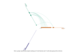](img/elf-NetBSD-x86_64-echo_allxrefs.json.png)
[](img/elf-OpenBSD-x86_64-sh_allxrefs.json.png)
[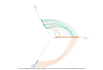](img/elf-solaris-sparc-ls_allxrefs.json.png)
[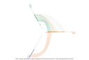](img/elf-solaris-x86-ls_allxrefs.json.png)
[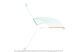](img/libSystem.B_allxrefs.json.png)
[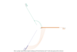](img/libexploit_allxrefs.json.png)

# Installing

You will need:

* bash, with at least the utilities `readlink` and `find`
  * on OSX you'll need to install gnu coreutils to get `greadlink` installed
* GNU `parallel`
* IDA (6.95 tested) with the following installed:
  * IDAPython (2.7 tested)
  * idascript https://github.com/devttys0/idascript (275be937d98da280fecdaf623fcc3c60ff1237e4 tested)
  * Sark https://github.com/tmr232/Sark (1.0 tested)
* apktool https://github.com/iBotPeaches/Apktool (2.2.1 tested)

For the hive-plots (`viz/` stuff), you will also need:

* node.js (v6.9.1 tested)
* `curl`
* a browser to view the `.html` files (chrome tested)

With all of those installed, clone the repo and run a script. You will then need to run `npm install` in the `viz/` subdirectory.

# The Scripts

There are both `.py` and shell-scripts in this repo. The `.py` files are all `idascript`-based IDA Python scripts; the shell scripts mostly call-out to those to enable batch processing.

| Shell Script Name | Description |
|------|-------------|
|```apk-recipe```| An all-in-one script to unpack an apk, find all .dex and binaries and analyze them all in parallel. |
|```get-analysis-targets```| ```get-analysis-targets <dirs...>``` to recursively descend and extract all ELF and Mach-o files to named dirs in the current directory. 'Thinning' the macho files into individual architectures |
|```analyze-all``` | ```analyze-all <target...>``` to recursively descend and produce ```.idb``` for every ELF in parallel |
|```unpack-all```| ```unpack-all <packages...>``` to unpack all ```.ipa``` and ```.apk``` to named dirs in the current directory. |
|```riz-all``` | ```riz-all <target...>``` to recursively descend and produce ```.idb``` for every ```.idb``` in parallel |
|```viz/do``` | creates a d3.js based vizualization given a json export of cross-references |
|```viz/*{.js,.css,.html}``` | other parts of the vizualization scripts, mostly dependencies for the d3.js client-side scripts. |

| IDA Python `idascript` Name | Description|
|-----|--------------|
|```rename_default_functions_with_a_prefix.py``` | Useful when preparing rizzo signatures, gives all `subXXXX` functions a prefix so that they are not ignored by rizzo |
|```idb2riz.py``` | simple idascript to run ```RizzoBuild()``` from the ```rizzo.py``` plugin on a ```X.idb``` to produce ```X.riz``` |
|```just_analysis.py``` | a 'stub' idascript for use by auto-analyze |
|```viz/all-crossrefs-idb.py``` | a simple script, to be used with the other script in `viz/` , that exports all the static analysis cross-references from an `.idb` to a json structure |

# Usage

## IDA Python Scripts

A good candidate for using auto-analysis scritps is `apk-recipe` which will unpack and auto-analyze all binaries (`.so` and `.dex` in an apk).

```
$ git clone https://github.com/cloakware-ctf/idascripts.git
[...]
$ mkdir -p target-apk/downloads
$ mv target.apk target-apk/downloads/
$ cd target-apk/
$ ../idascripts/apk-recipe .
```

At this point any and all binaries in the `.apk` will have been extracted and auto-analyzed by IDA Pro. All `.idb` databases will be in well-named folders under `analysis`. Note that the script will execute the IDA Pro analysis in parallel (using GNU `parallel`) to save time.

## Hiveplot Binary Visualizer

The other interesting feature of these scripts is to produce hive-plot vizualizations using `viz/do`. This script will hunt for any IDA pro databases and create hive plot vizualiations of the xrefs therein. Continuing the above analysis:

```
./viz/do analysis/
```

At this point there will be a standalone `.html` file containing an interactive hive-plot for each `.idb` in `analysis/`.

# Future Work

Hive Plots:

* Add a *duplicate* axis (like in Mike Bostock's example) for cases where we want to see intra-group links
* Auto-orient the axes so that the *most-central* axis is most-horizontal
* Enable dragging of axis to rotate axis
* Enable dragging nodes to re-order
* For panel-plots (not pictured in this repo) keep pan independent, but still tie scale
* Use `tt` for node names
* add floating labels at border of visible areas on edges when they are selected or active
* dark theme

Pull requests are welcome.

